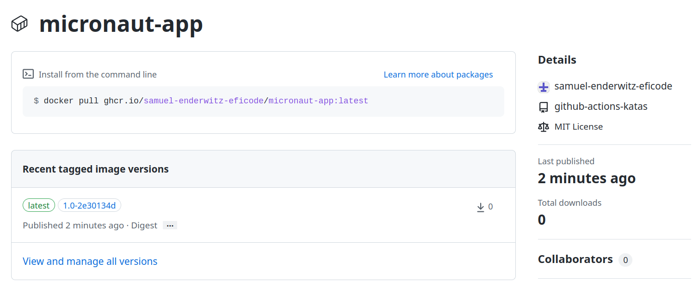

# Building Docker Images

Next step is to have our application packaged as a docker image for easy distribution. 

We have some requirements for our pipeline step:

- Should build our application as a docker image.
- Should tag the image with both the git sha and "latest". (Do not use such general tags in real life!)
- Should push the image to Githubs docker registry.

In order for this to work, we need three environment variables:
- `docker_username` the username for docker registry.
- `docker_password` the password for docker registry.
- `GIT_COMMIT`  the name of the git commit that is being built.

You can set these environment variables as global variables in your workflow through the `env` section.

```YAML
env:
  docker_username: <your docker username>
  docker_password: <your docker password>
  GIT_COMMIT: <your git commit>
```

The two scripts: `ci/build-docker.sh` and `ci/push-docker.sh` expects all three environment variables to be set.

## Build-in environment variables

Many of the common information pieces for a build is set in default environment variables.

Examples of these are:

- The name of the repository
- The name of the branch
- The SHA of the commit

You can see the ones you can use directly inside a step here: https://docs.github.com/en/actions/learn-github-actions/environment-variables#default-environment-variables

Github Actions also has a list of contexts.

Contexts are a way to access information about workflow runs, runner environments, jobs, and steps. 
Each context is an object that contains properties, which can be strings or other objects.
You can see them here: https://docs.github.com/en/actions/learn-github-actions/contexts#about-contexts 

The default environment variables that GitHub sets are available to every step in a workflow.
Contexts are also available before the steps, as when defining the `env` section of the workflow. 


### Tasks

- Add a new job named `Docker-image` that requires the `Build` to be completed.
You need to add package write permissions so that your action can upload the container to the registry.

```YAML
  Docker-image:
    runs-on: ubuntu-latest
    needs: [Build]
    permissions:
      packages: write
```

In order for us to create and push the docker image, we need the CI scripts, the Dockerfile and the Artifact. All of them are present in the `code` artifact created in the last exercise.

- Add a step in `Docker-image` which downloads the `code` artifact.


<details>
    <summary> :bulb: Hint on how it looks like </summary>

```YAML
    - name: Download code
      uses: actions/download-artifact@v4
      with:
        name: code
        path: .
```
</details>

- Add `docker_username` and `docker_password` as environmental variables on top of the workflow file. 

```YAML
name: Main workflow
on: push
env: # Set the secret as an input
  docker_username: ${{ github.actor }} 
  docker_password: ${{ secrets.GITHUB_TOKEN }} #Nees to be set to be made available to the workflow
jobs:
  Build:
```

- Add GIT_COMMIT environment variable as well, that should contain the commit sha of the repository.

> Tip! it needs the same "wrapping" (`${{}}`) as the other environment variables, and can be found in the `github` [context](https://docs.github.com/en/actions/learn-github-actions/contexts#about-contexts).

- Run the `ci/build-docker.sh` and `ci/push-docker.sh` scripts.

Ready steps looks like:
```YAML
    - name: build docker
      run: bash ci/build-docker.sh
    - name: push docker
      run: bash ci/push-docker.sh
```

> Hint: The reason we have bash first is to bypass the file permissions. If you don't do this, you will get a permission denied error.

- Submit your changes, and see that the image is built and pushed to the GitHub container registry.

> Tip! You can find the image under the `Packages` tab on your profile.

## Using actions instead of scrtipts

The above job can be also done by using actions: `docker/login-action@v3` and `docker/build-push-action@v5`, what will provide the same functionality. You can find it in the example below:

<details>
<summary> Doing the same using Actions </summary>

```yaml
on: push
jobs:
  build-and-push-latest:
    runs-on: ubuntu-latest
    permissions:
      packages: write
    steps:
      - name: Login to DockerHub
        uses: docker/login-action@v3
        with:
          registry: ghcr.io
          username: ${{ github.actor }}
          password: ${{ secrets.GITHUB_TOKEN }}
      - name: Build and push
        uses: docker/build-push-action@v5
        with:
          context: app
          push: true
          tags: ghcr.io/${{ github.actor }}/micronaut-app:1.0-${{ github.sha }},ghcr.io/${{ github.actor }}/micronaut-app:latest
```

</details>

### Solution 

If you strugle and need to see the whole ***Solution*** you can click this [link](../trainer/.github/workflows/docker-image.yaml)


### Results

You should be able to see your docker image on your GitHub account as: 



